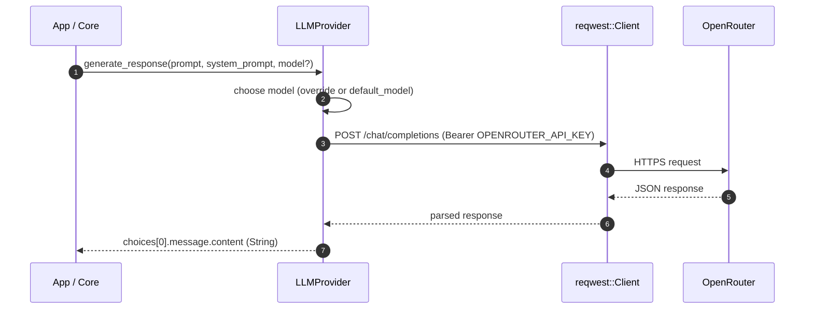

# 🧠🌐 PAGI External API & LLM Provider Library (`pagi-external-api-lib`)

Centralized, secure **external network I/O** + **LLM orchestration** for PAGI.

This crate is designed to keep your “core logic” clean by putting:
- 🔐 secret/config loading
- 🌍 all outbound HTTP calls
- 🤖 LLM provider orchestration

…in one place.

---

## ✨ What this crate does

✅ Loads configuration from environment variables (and an optional `.env` file)

✅ Calls **OpenRouter** Chat Completions (`/chat/completions`) asynchronously

✅ Provides placeholder external service clients (Jira, CrowdStrike) to show where
real integrations will live

---

## 🧩 Repository structure

```
.
├── Cargo.toml
├── README.md
└── src
    ├── api_clients.rs
    ├── config.rs
    ├── lib.rs
    └── llm_provider.rs
```

Key modules:
- `src/config.rs` — config + secret loading
- `src/llm_provider.rs` — OpenRouter LLM calls
- `src/api_clients.rs` — external service client placeholders
- `src/lib.rs` — re-exports for a clean public API

---

## 🚀 Getting started

### 1) Install Rust

Install Rust using rustup:
- https://rustup.rs/

Verify:
```bash
rustc --version
cargo --version
```

### 2) Clone the repo

```bash
git clone git@github.com:c04ch1337/pagi-external-api-lib.git
cd pagi-external-api-lib
```

### 3) Configure environment variables

This crate loads variables from:
- your shell environment, and
- an optional `.env` file in the project root (useful for local dev)

Create `.env` (do **not** commit it):
```bash
cat > .env <<'EOF'
OPENROUTER_API_KEY=your_openrouter_key_here
OPENROUTER_DEFAULT_MODEL=openai/gpt-4o-mini

# Optional placeholders
JIRA_API_TOKEN=...
JIRA_BASE_URL=https://jira.example.com

CROWDSTRIKE_API_TOKEN=...
CROWDSTRIKE_BASE_URL=https://api.crowdstrike.com
EOF
```

✅ Required:
- `OPENROUTER_API_KEY`

Optional:
- `OPENROUTER_DEFAULT_MODEL` (defaults to `openai/gpt-4o-mini`)
- `JIRA_API_TOKEN`, `JIRA_BASE_URL`
- `CROWDSTRIKE_API_TOKEN`, `CROWDSTRIKE_BASE_URL`

---

## 🧪 Build / run checks

```bash
cargo check
```

---

## 🧑‍💻 Usage examples

### Example: Call OpenRouter to generate a response

```rust
use pagi_external_api_lib::LLMProvider;

#[tokio::main]
async fn main() {
    let llm = LLMProvider::new();

    let text = llm
        .generate_response(
            "Write a 1-sentence summary of why config isolation matters.",
            "You are a helpful assistant.",
            None, // uses OPENROUTER_DEFAULT_MODEL
        )
        .await
        .expect("OpenRouter call failed");

    println!("LLM response: {text}");
}
```

### Example: Use placeholder Jira client

```rust
use pagi_external_api_lib::{JiraClient, PAGIConfig};

#[tokio::main]
async fn main() {
    let cfg = PAGIConfig::load();
    let jira = JiraClient::new(cfg);

    jira.create_issue("Investigate incident #123").await.unwrap();
}
```

---

## 🏗️ Architecture

### High-level view (crate responsibilities)

```mermaid
flowchart TB
  Core[🧠 PAGI Core Logic]
  Ext[🌐 pagi-external-api-lib]
  OR[🤖 OpenRouter API]
  Jira[📌 Jira API]
  CS[🛡️ CrowdStrike API]
  Env[🔐 .env + Environment Variables]

  Core -->|calls| Ext
  Env -->|loads| Ext
  Ext -->|HTTP| OR
  Ext -->|HTTP (future)| Jira
  Ext -->|HTTP (future)| CS
```

### Low-level view (LLM request flow)



### Configuration loading flow

```mermaid
flowchart LR
  A[Start] --> B[dotenvy::dotenv()]
  B --> C[Read env vars]
  C --> D{OPENROUTER_API_KEY set?}
  D -- No --> E[panic! (secure init)]
  D -- Yes --> F[PAGIConfig]
```

---

## 📦 Dependencies

From `Cargo.toml`:

| Dependency | Purpose |
|---|---|
| `tokio` | Async runtime |
| `reqwest` | HTTP client |
| `serde` + `serde_json` | Serialization / JSON |
| `dotenvy` | Loads `.env` files |
| `async-trait` | Async traits (for future provider abstractions) |

---

## 🧰 Testing & debugging

### ✅ Testing

There are currently no dedicated unit/integration tests.

Recommended next steps:
- Add unit tests for config parsing (with controlled env vars)
- Add mocked HTTP tests for OpenRouter (e.g., using `wiremock`)

Run tests:
```bash
cargo test
```

### 🐛 Debugging tips

Common issues:

1) **Missing env var**
- If `OPENROUTER_API_KEY` is missing, config loading will panic by design.

2) **HTTP errors**
- OpenRouter failures will return an error from `reqwest`.

Debug workflow:
- Confirm `.env` is present locally
- Print which model you’re sending
- Use `RUST_LOG` (when you add logging) to trace HTTP request/response metadata

Useful commands:
```bash
cargo check
cargo clippy
cargo fmt
```

---

## 🤝 Contributing

Contributions are welcome—keep changes clean and reviewable.

### Guidelines

1) Create a feature branch:
```bash
git checkout -b feat/your-feature
```

2) Run formatting + linting:
```bash
cargo fmt
cargo clippy -- -D warnings
```

3) Keep commits small and descriptive

4) Open a PR with:
- what changed
- why it changed
- how it was tested

---

## 🛣️ Roadmap / future plans

Planned improvements (in rough priority order):

### 🤖 LLM provider improvements
- Provider abstraction trait (OpenRouter, OpenAI, etc.)
- Better error types (avoid leaking secrets, include context)
- Retries with exponential backoff
- Timeouts, rate limiting, and circuit breaking
- Streaming responses (SSE) for chat UX

### 🔐 Security improvements
- Secret redaction utilities
- Stronger config validation (explicit “required vs optional” schema)
- Support for external secret managers (Vault, AWS SSM, etc.)

### 🌍 External API clients
- Real Jira REST client (issue create, status transitions, comments)
- Real CrowdStrike workflows (host lookup, containment actions)

### 🧪 Testing
- Integration tests with mock servers
- Contract tests for payload formats

---

## 📄 License

License is currently **TBD**.

